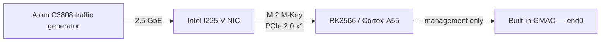

# DPDK with an external PCIe NIC on Orange Pi 3B

> Engineering note: this describes the ProcessBus test platform, not a generic
> upstream DPDK configuration for every RK3566 board.

The Orange Pi 3B measurements did **not** use its built-in Ethernet interface.
The DPDK data path used an external Intel I225-V 2.5 GbE NIC connected through
the board's M.2 M-Key PCIe 2.0 x1 path. The built-in GMAC (`end0`) remained
available for management and packet capture.

## Why the normal DPDK memory model was not enough

The RK3566 PCIe root complex is not cache-coherent. A NIC DMA write therefore
does not automatically invalidate a cache line already held by the CPU, and a
CPU write is not automatically visible to the NIC.

With descriptor rings in ordinary cacheable hugepage memory, adjacent 16-byte
descriptors shared 64-byte cache lines. The I225 TX queue stalled at the first
ring wrap—1,024 descriptors with the default configuration. This was a DMA
coherency problem, not an Ethernet or IEC 61850 limit.

## Memory design used in the tests

The working design separates descriptors from packet payloads:

| Region | Memory type | Coherency handling |
|---|---|---|
| RX/TX descriptor rings | Normal Non-Cacheable CMA memory from `u-dma-buf` | Kept out of the CPU cache |
| Packet mbufs | Cacheable DPDK hugepages | Explicit cache maintenance in the IGC PMD |

The platform-specific DPDK patch performs:

- `dc cvac` before TX so the NIC reads current payload data;
- `dc civac` after RX DMA and before CPU parsing so the CPU reads current data;
- `dsb sy` before NIC doorbell writes so prior memory operations are complete.

R-GOOSE GCM adds another corner case: in-place decryption dirties the received
mbuf. On this platform the parser decrypts into a per-thread scratch buffer, so
a later cache write-back cannot corrupt a new frame DMA-written into a recycled
mbuf.

## Platform setup

The relevant pieces are:

1. Reserve CMA for `u-dma-buf` and hugepages for packet mbufs.
2. Load `u-dma-buf` with `sync_mode=2` so the mapping is Normal
   Non-Cacheable—not Device memory.
3. Bind the external I225-V to `uio_pci_generic`.
4. Add the `u-dma-buf` region as a DPDK external heap and use its socket ID when
   creating RX/TX queues.
5. Build the IGC PMD with the non-coherent-DMA cache-maintenance patch enabled.

This keeps descriptor access correct without forcing every packet read through
uncached memory. The trade-off is a platform-specific fast path and cache
maintenance on every packet.

## Measured RX-burst cost

Across 42 matching clean scenarios below 95% occupancy, moving the processing
timer across `rte_eth_rx_burst()` measured a median productive-call cost of 702
ns/frame on Orange Pi versus 48 ns/frame on Atom. The Orange Pi cost was nearly
additive across traffic profiles, security modes and crypto backends, which is
why it is most visible with small frames at high packet rates.

This is a whole-platform comparison, not a controlled memory-type-only A/B
test: the CPU, NIC and PMD also differ. The method, matched summary and
representative measurements are in [RX CPU accounting](RX_CPU_Accounting.md).

## Implementation references

- [Orange Pi onboarding and commands](../deploy/orangepi3b/README.md)
- [`u-dma-buf` external heap](../src/dpdk_cpp/udmabuf_heap.hpp)
- [Queue placement in Normal-NC memory](../src/dpdk_cpp/dpdk_port_class.hpp)
- [DPDK IGC cache-maintenance patch](../ci/patches/dpdk/0001-noncoherent-igc.patch)
- [Orange Pi platform setup](../deploy/orangepi3b/setup_platform.sh)

The important qualification for the performance results is simple: they
measure DPDK through an external PCIe NIC after these coherency changes. They do
not characterize the Orange Pi's built-in Ethernet interface.
