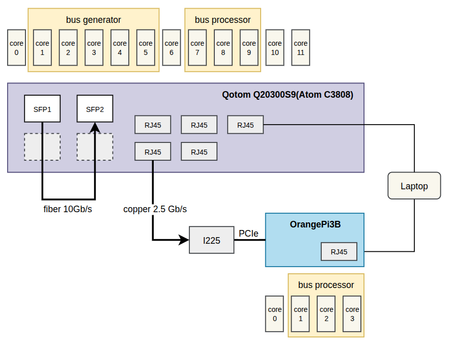
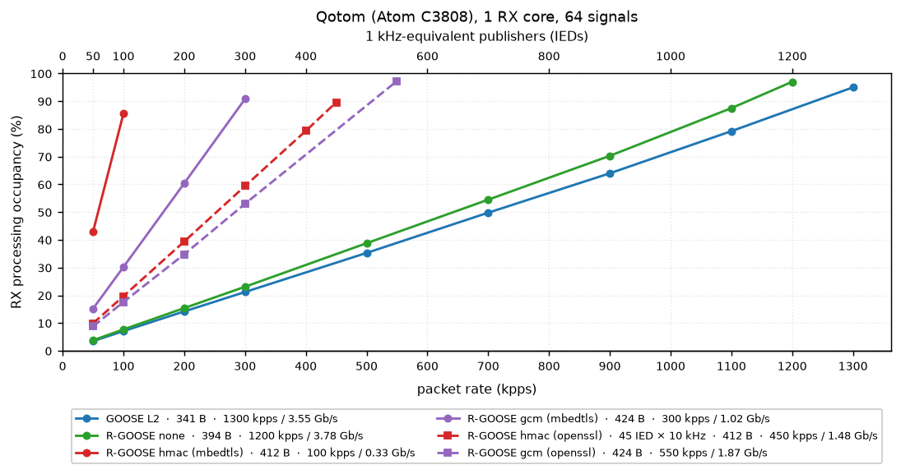
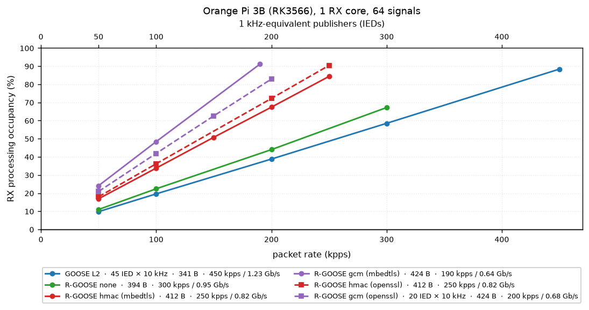
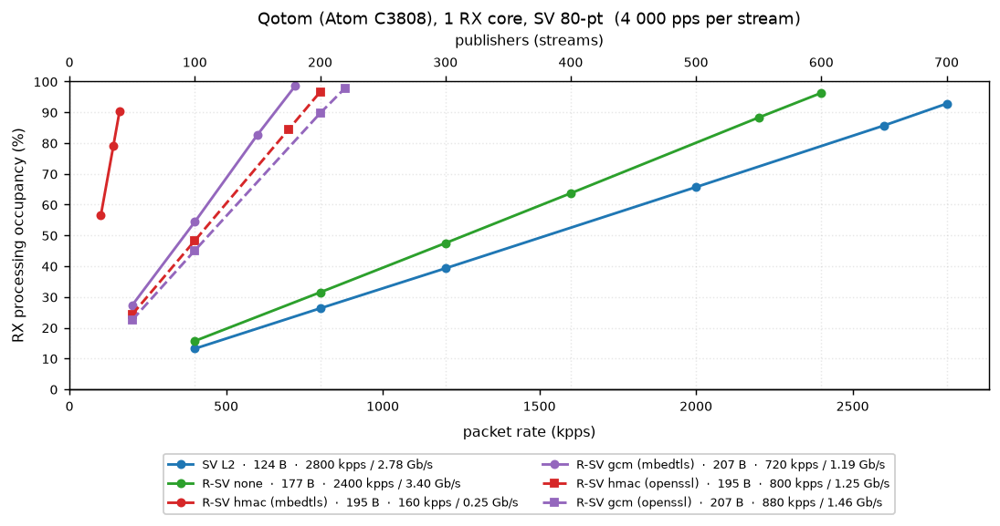
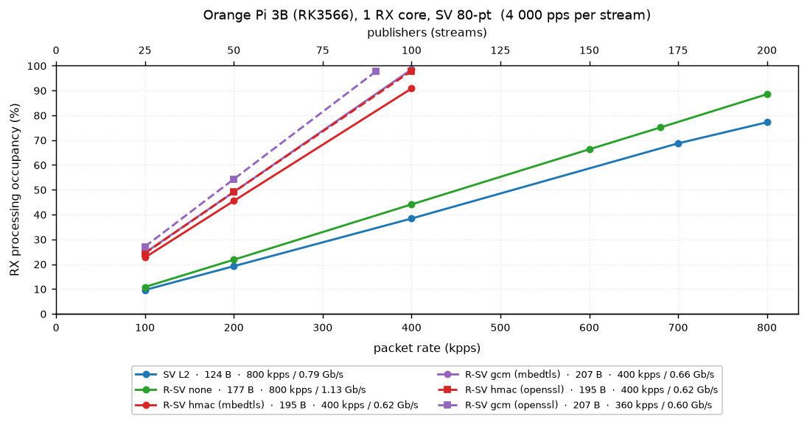
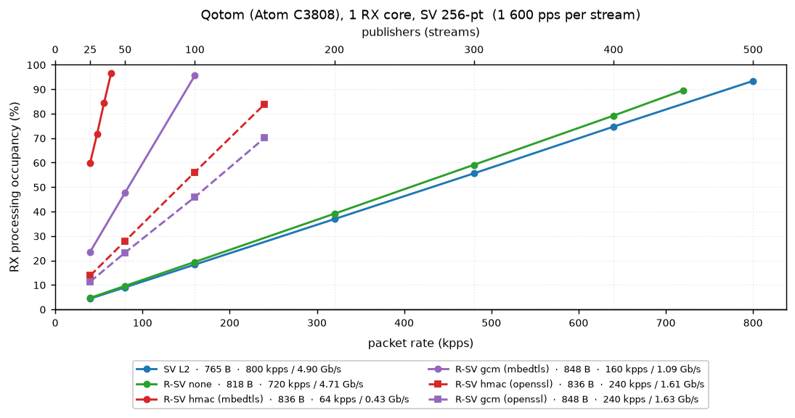
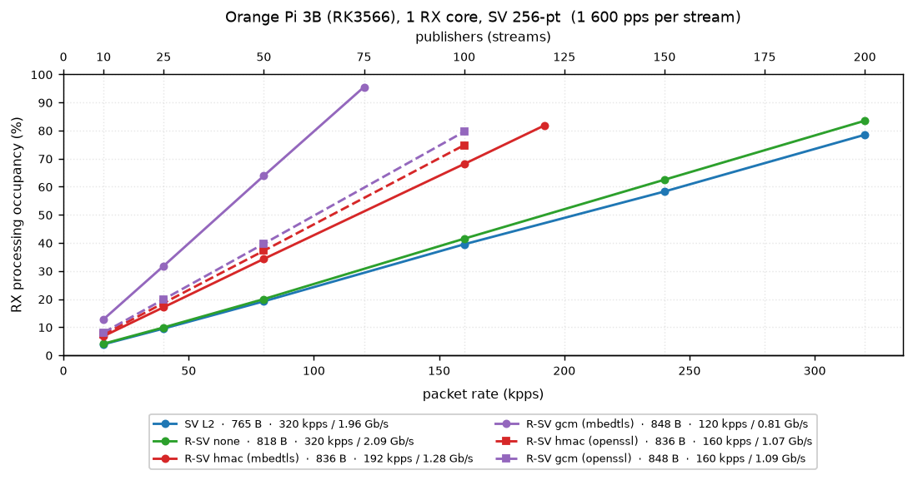
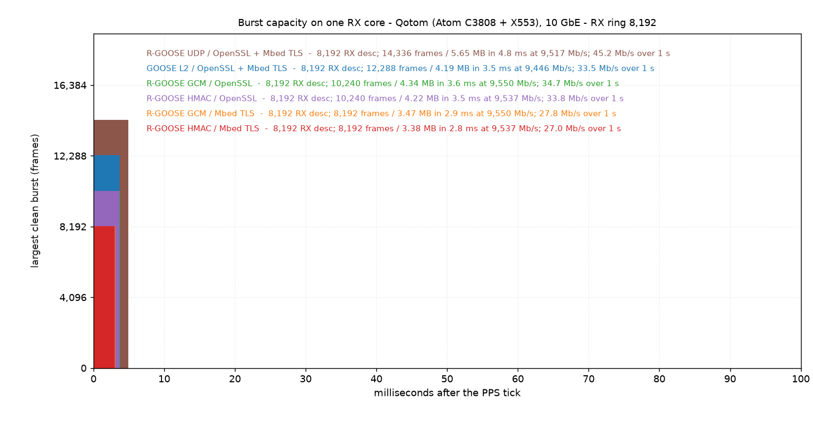
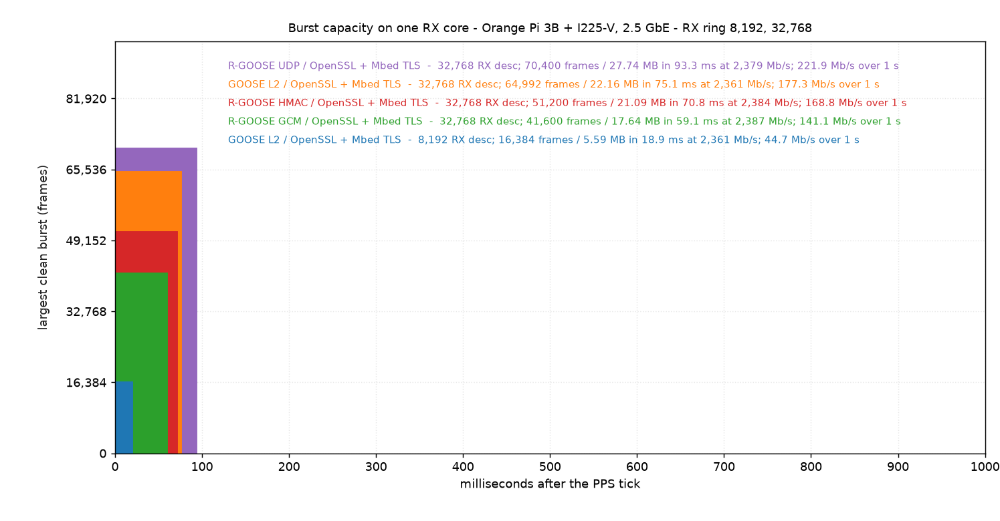

# R-GOOSE and R-SV with DPDK on x86 and ARM

In 2025, I measured the performance of IEC 61850 GOOSE and SV messages on an
Intel Atom. This time, I compared their routable counterparts, R-GOOSE and R-SV,
on ARM and x86.

## Quick reminder

- GOOSE and SV are IEC 61850 protocols that use L2 Ethernet multicast. GOOSE
  carries events and status information, while SV carries sampled measurements
  to many subscribers.

- R-GOOSE and R-SV are their routable IEC 61850-90-5 counterparts. They retain
  the same inner message format, add an IPv4/UDP multicast session envelope and
  support optional security.

- The three dataset/sample profiles used here are `GOOSE-64` (64 dataset
  entries), `SV80` (one ASDU per frame and 4,000 frames/s per stream) and
  `SV256` (eight ASDUs per frame and 1,600 frames/s per stream).

- The R-message security modes are `none` (routing envelope only; no
  authentication or encryption), `HMAC` (HMAC-SHA256-128 authentication and
  integrity protection; the payload remains visible) and `GCM` (AES-128-GCM
  authenticated encryption; the payload is encrypted).

- DPDK provides a user-space, polling-based packet-I/O path. In these tests,
  each RX core polls continuously instead of sleeping between packets.

## Methodology

- **Two data paths.** The 10 Gb/s tests use an SFP loopback between two Atom C3808
  ports. For the ARM tests, the Atom C3808 sends over 2.5 Gb/s Ethernet to an external
  Intel I225-V connected to the Orange Pi through M.2/PCIe. The Orange Pi's
  built-in Ethernet port is used only for management.

- **Dedicated DPDK cores.** Generator and receiver run on separate pinned
  lcores. Results use either one or three RX cores, as stated in each table or
  plot.

- **Measured load points.** Each sustained-load point runs for 60 seconds with
  a fixed number of publishers and publication frequency. Packet rate,
  bandwidth and RX processing occupancy are steady-state medians.

- **RX processing occupancy.** An RX lcore polls continuously. For every
  non-empty burst, accounting starts before `rte_eth_rx_burst()` and includes
  descriptor access, frame processing and validation. Empty polls are excluded.
  This is not operating-system CPU utilization.

- **Orange Pi DMA caveat.** The RK3566 PCIe path is not cache-coherent. The
  working design keeps descriptor rings in Normal-NC memory and packet mbufs in
  cacheable memory with explicit IGC cache maintenance. The implementation is
  described in [DPDK with an external PCIe NIC on Orange Pi 3B](DPDK_on_OrangePi3B.md).

- **No extrapolated limits.** Tables report the highest retained qualifying
  point from the active matrices, not a calculated hardware maximum. OpenSSL
  and Mbed TLS use separate builds with the same traffic matrices.

- **Strict acceptance.** A result qualifies only when RX equals TX, GOOSE and
  SV sequence counters report no gaps, and NIC missed/error counters remain at
  zero. Parser, authentication, queue and send errors, software-ring overflow
  and mbuf exhaustion must also remain at zero.

- **Full protocol validation.** Every GOOSE dataset entry and every SV ASDU and
  signal-quality field is parsed. R-GOOSE and R-SV also validate SPDU/security,
  IPv4/UDP structure, the multicast destination and checksums.

- **Burst tests are separate.** The generator stages one second of traffic and
  releases it back-to-back at the PPS tick, then remains idle. The reported
  bracket is the largest burst with no RX overload and the first burst that
  increments `imissed` or the software-ring overflow counter.

## Full comparison with one RX core

| Platform + NIC | RX cores | IEC 61850 | Transport | IEDs × frequency / streams | Frame | Frame vs L2 | PPS | Ethernet | RX CPU | PPS vs L2 | CPU/packet vs L2 |
|---|---:|---|---|---:|---:|---:|---:|---:|---:|---:|---:|
| Atom C3808 + X553 | 1 | GOOSE | L2 | 1,300 IEDs × 1 kHz | 341 B | 1.00× | 1,300 kpps | 3,546.4 Mb/s | 95.0% | 1.00× | 1.00× |
| Atom C3808 + X553 | 1 | R-GOOSE | UDP | 1,200 IEDs × 1 kHz | 394 B | **1.16×** | 1,200 kpps | **3,782.4 Mb/s** | 97.0% | 0.92× | **1.11×** |
| Atom C3808 + X553 | 1 | R-GOOSE | UDP/HMAC | 45 IEDs × 10 kHz | 412 B | **1.21×** | 450 kpps | 1,483.2 Mb/s | 89.6% | 0.35× | **2.72×** |
| Atom C3808 + X553 | 1 | R-GOOSE | UDP/GCM | 550 IEDs × 1 kHz | 424 B | **1.24×** | 550 kpps | 1,865.6 Mb/s | 97.3% | 0.42× | **2.42×** |
| Atom C3808 + X553 | 1 | SV80 | L2 | 700 streams | 124 B | 1.00× | 2,800 kpps | 2,777.6 Mb/s | 92.8% | 1.00× | 1.00× |
| Atom C3808 + X553 | 1 | R-SV80 | UDP | 600 streams | 177 B | **1.43×** | 2,400 kpps | 3,398.4 Mb/s | 96.3% | 0.86× | **1.21×** |
| Atom C3808 + X553 | 1 | R-SV80 | UDP/HMAC | 200 streams | 195 B | **1.57×** | 800 kpps | 1,248.0 Mb/s | 96.6% | 0.29× | **3.65×** |
| Atom C3808 + X553 | 1 | R-SV80 | UDP/GCM | 220 streams | 207 B | **1.67×** | 880 kpps | 1,457.3 Mb/s | 97.9% | 0.31× | **3.36×** |
| Atom C3808 + X553 | 1 | SV256 | L2 | 500 streams | 765 B | 1.00× | 800 kpps | **4,896.0 Mb/s** | 93.4% | 1.00× | 1.00× |
| Atom C3808 + X553 | 1 | R-SV256 | UDP | 450 streams | 818 B | 1.07× | 720 kpps | **4,711.7 Mb/s** | 89.6% | 0.90× | 1.07× |
| Atom C3808 + X553 | 1 | R-SV256 | UDP/HMAC | 150 streams | 836 B | 1.09× | 240 kpps | 1,605.1 Mb/s | 83.9% | 0.30× | **2.99×** |
| Atom C3808 + X553 | 1 | R-SV256 | UDP/GCM | 150 streams | 848 B | **1.11×** | 240 kpps | 1,628.2 Mb/s | 70.1% | 0.30× | **2.50×** |
| Orange Pi 3B + I225-V | 1 | GOOSE | L2 | 45 IEDs × 10 kHz | 341 B | 1.00× | 450 kpps | 1,227.6 Mb/s | 88.4% | 1.00× | 1.00× |
| Orange Pi 3B + I225-V | 1 | R-GOOSE | UDP | 300 IEDs × 1 kHz | 394 B | **1.16×** | 300 kpps | 945.6 Mb/s | 67.2% | 0.67× | **1.14×** |
| Orange Pi 3B + I225-V | 1 | R-GOOSE | UDP/HMAC | 250 IEDs × 1 kHz | 412 B | **1.21×** | 250 kpps | 824.0 Mb/s | 90.4% | 0.56× | **1.84×** |
| Orange Pi 3B + I225-V | 1 | R-GOOSE | UDP/GCM | 20 IEDs × 10 kHz | 424 B | **1.24×** | 200 kpps | 678.4 Mb/s | 82.9% | 0.44× | **2.11×** |
| Orange Pi 3B + I225-V | 1 | SV80 | L2 | 200 streams | 124 B | 1.00× | 800 kpps | 793.6 Mb/s | 77.2% | 1.00× | 1.00× |
| Orange Pi 3B + I225-V | 1 | R-SV80 | UDP | 200 streams | 177 B | **1.43×** | 800 kpps | 1,132.8 Mb/s | 88.5% | 1.00× | **1.15×** |
| Orange Pi 3B + I225-V | 1 | R-SV80 | UDP/HMAC | 100 streams | 195 B | **1.57×** | 400 kpps | 624.0 Mb/s | 97.9% | 0.50× | **2.54×** |
| Orange Pi 3B + I225-V | 1 | R-SV80 | UDP/GCM | 90 streams | 207 B | **1.67×** | 360 kpps | 596.2 Mb/s | 97.7% | 0.45× | **2.81×** |
| Orange Pi 3B + I225-V | 1 | SV256 | L2 | 200 streams | 765 B | 1.00× | 320 kpps | **1,958.4 Mb/s** | 78.5% | 1.00× | 1.00× |
| Orange Pi 3B + I225-V | 1 | R-SV256 | UDP | 200 streams | 818 B | 1.07× | 320 kpps | **2,094.1 Mb/s** | 83.5% | 1.00× | 1.06× |
| Orange Pi 3B + I225-V | 1 | R-SV256 | UDP/HMAC | 100 streams | 836 B | 1.09× | 160 kpps | 1,070.1 Mb/s | 74.8% | 0.50× | **1.91×** |
| Orange Pi 3B + I225-V | 1 | R-SV256 | UDP/GCM | 100 streams | 848 B | **1.11×** | 160 kpps | 1,085.4 Mb/s | 79.6% | 0.50× | **2.03×** |

### Productive RX-burst (`rte_eth_rx_burst`) cost

| Platform + NIC | Descriptor ring | Parse only | Parse + RX burst | RX-burst delta |
|---|---|---:|---:|---:|
| Orange Pi 3B + I225-V | Normal-NC | 1,785 ns/frame | 2,601 ns/frame | **702 ns/frame** |
| Atom C3808 + X553 | Cacheable | 1,245 ns/frame | 1,294 ns/frame | 48 ns/frame |

Each of the first two columns is a median of its own measurements, and the
delta is the median of the 42 per-scenario differences, so the columns do not
subtract to it.

The method and representative rows are in [RX CPU accounting](RX_CPU_Accounting.md).

### GOOSE / R-GOOSE — 64-signal plots

### SV / R-SV — 80-point frames

### SV / R-SV — 256-point frames

### SV256 — three RX cores

| platform + NIC | transport | streams | frame | RX kpps | RX Mb/s | processing % total | average/core % |
|---|---|--:|--:|--:|--:|--:|--:|
| Atom C3808 + X553 | SV L2 | 950 | 765 B | 1,520 | **9,302.4** | 208.2 | 69.4 |
| Atom C3808 + X553 | R-SV UDP | 890 | 818 B | 1,424 | **9,318.7** | 206.8 | 68.9 |
| Atom C3808 + X553 | R-SV HMAC (OpenSSL) | 330 | 836 B | 528 | 3,531.3 | 195.6 | 65.2 |
| Atom C3808 + X553 | R-SV GCM (OpenSSL) | 400 | 848 B | 640 | **4,341.8** | 206.6 | 68.9 |
| Orange Pi 3B + I225-V | SV L2 | 240 | 765 B | 384 | **2,350.1** | 81.8 | 27.3 |
| Orange Pi 3B + I225-V | R-SV UDP | 200 | 818 B | 320 | **2,094.1** | 71.5 | 23.8 |
| Orange Pi 3B + I225-V | R-SV HMAC (OpenSSL) | 200 | 836 B | 320 | 2,140.2 | 138.3 | 46.1 |
| Orange Pi 3B + I225-V | R-SV GCM (OpenSSL) | 200 | 848 B | 320 | 2,170.9 | 153.7 | 51.2 |

## One RX core — burst limits

| device | transport | crypto build | RX ring | largest burst without RX overload | first burst with RX overflow | burst ms | during burst Mb/s | measured 1 s avg Mb/s |
|---|---|---|--:|--:|--:|--:|--:|--:|
| Atom C3808 | GOOSE L2 | OpenSSL | 8,192 | 12,288 | 16,384 | 3.55 | 9,446 | 33.5 |
| Atom C3808 | GOOSE L2 | Mbed TLS | 8,192 | 12,288 | 16,384 | 3.55 | 9,446 | 33.5 |
| Atom C3808 | R-GOOSE UDP | OpenSSL | 8,192 | 14,336 | 16,384 | 4.75 | 9,517 | 45.2 |
| Atom C3808 | R-GOOSE UDP | Mbed TLS | 8,192 | 14,336 | 16,384 | 4.75 | 9,517 | 45.2 |
| Atom C3808 | R-GOOSE HMAC | OpenSSL | 8,192 | 10,240 | 12,288 | 3.54 | 9,537 | 33.8 |
| Atom C3808 | R-GOOSE HMAC | Mbed TLS | 8,192 | 8,192 | 10,240 | 2.83 | 9,537 | 27.0 |
| Atom C3808 | R-GOOSE GCM | OpenSSL | 8,192 | 10,240 | 12,288 | 3.64 | 9,550 | 34.7 |
| Atom C3808 | R-GOOSE GCM | Mbed TLS | 8,192 | 8,192 | 10,240 | 2.91 | 9,550 | 27.8 |
| Orange Pi 3B | GOOSE L2 | OpenSSL | 8,192 | 16,384 | 19,456 | 18.93 | 2,361 | 44.7 |
| Orange Pi 3B | GOOSE L2 | Mbed TLS | 8,192 | 16,384 | 19,456 | 18.93 | 2,361 | 44.7 |
| Orange Pi 3B | GOOSE L2 | OpenSSL | 32,768 | 64,992 | 78,016 | 75.08 | 2,361 | 177.3 |
| Orange Pi 3B | GOOSE L2 | Mbed TLS | 32,768 | 64,992 | 78,016 | 75.08 | 2,361 | 177.3 |
| Orange Pi 3B | R-GOOSE UDP | OpenSSL | 32,768 | 70,400 | 83,200 | 93.27 | 2,379 | 221.9 |
| Orange Pi 3B | R-GOOSE UDP | Mbed TLS | 32,768 | 70,400 | 83,200 | 93.27 | 2,379 | 221.9 |
| Orange Pi 3B | R-GOOSE HMAC | OpenSSL | 32,768 | 51,200 | 60,800 | 70.78 | 2,384 | 168.8 |
| Orange Pi 3B | R-GOOSE HMAC | Mbed TLS | 32,768 | 51,200 | 60,800 | 70.78 | 2,384 | 168.8 |
| Orange Pi 3B | R-GOOSE GCM | OpenSSL | 32,768 | 41,600 | 51,200 | 59.11 | 2,387 | 141.1 |
| Orange Pi 3B | R-GOOSE GCM | Mbed TLS | 32,768 | 41,600 | 51,200 | 59.11 | 2,387 | 141.1 |

- **RX-ring capacity is visible.** On Orange Pi GOOSE L2, increasing the ring
  from 8,192 to 32,768 descriptors raised the largest clean burst from 16,384
  to 64,992 frames—almost exactly 4×.

- **Security reduces the burst that one core can absorb.** Against the
  70,400-frame Orange Pi UDP result, HMAC retained 51,200 frames and GCM 41,600.
  On the Atom C3808, OpenSSL retained 10,240 secured frames versus 14,336 for UDP; Mbed
  TLS retained 8,192.

- **Backend sensitivity is platform-dependent.** Atom C3808 OpenSSL carried 25%
  more HMAC and GCM frames than Mbed TLS before overload. Orange Pi produced
  the same measured HMAC and GCM brackets with both backends (OpenSSL and Mbed TLS).

## Conclusion

- **Routing without security is cheap.** Atom processed R-GOOSE UDP at
  1,200 kpps / 3,782.4 Mb/s. Orange Pi retained the full 800 kpps SV80
  packet rate with R-SV UDP.

- **Security is the expensive part.** At 100 kpps, Atom R-GOOSE HMAC used
  19.7% with OpenSSL and 85.5% with Mbed TLS. Orange Pi used 36.2% and
  33.8%, respectively.

- **Small-frame performance on Orange Pi is limited by packet acquisition.**
  The productive RX-burst call added 702 ns/frame, compared with 48 ns/frame
  on Atom.

- **Large SV frames reached multi-gigabit rates.** SV256 reached 9.3 Gb/s
  across three Atom cores and 2.1 Gb/s on one Orange Pi core.

- **Burst shape matters.** A 70,400-frame UDP burst appeared as only
  221.9 Mb/s when averaged over one second.
  
